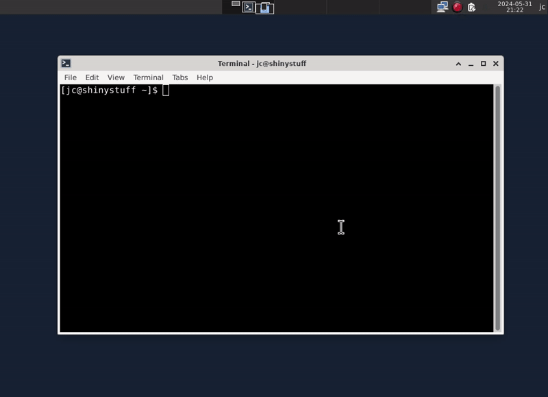

# Systranything

[![nix][status-nix-png]][status-nix] 
[![haskell-ci][status-haskell-ci-png]][status-haskell-ci]
[![hackage][hackage-png]][hackage]

`systranything` lets you put anything in your system tray. It is supported by 
all destop environment that implements the [StatusNotifierHost 
specification][status-notifier-host] from [freedesktop.org][freedesktop] 
([KDE][kde], [XFCE][xfce], ...).

It uses a YAML file which describes the icon to put in the system tray along a 
context menu and callbacks to be executed in a shell.

The menu can contain labels, separators, submenus, checkboxes and radiobuttons. 
Scroll events can be triggered on the main icon.

Among other things, I use it to change my VPN settings. The icon shows its 
current status:



What you can do with it:

- a custom launcher menu
- a volume icon
- a menu to turn on or off your VPN
- a menu to toggle dual monitor setups
- anything that requires a status icon and scriptable actions

See [the example file](./tests/data/example.yaml) to get started.

Run it with:

```bash
$ systranything -f ./tests/data/example.yaml
```

It has a verbose mode which can be turned on with `-v`. It writes on `stdout` 
the commands executed along their outputs.

# Hacking

The project can be built with [nix][nix].

Install with:

```bash
$ nix profile install
```

Build with:

```bash
$ nix build
```

The binary is then created in `./result/bin/systranything`

Hack with:

```bash
$ nix develop
```

You will be dropped in a shell with all the needed tools in scope: `cabal` to 
build the project and `haskell-language-server` for a better developer 
experience.

[freedesktop]: https://www.freedesktop.org/wiki/
[hackage-png]: https://img.shields.io/hackage/v/systranything
[hackage]: https://hackage.haskell.org/package/systranything
[kde]: https://kde.org/
[nix]: https://nixos.org/
[polybar]: https://polybar.github.io/
[status-haskell-ci-png]: https://github.com/jecaro/systranything/workflows/Haskell-CI/badge.svg
[status-haskell-ci]: https://github.com/jecaro/systranything/actions/workflows/haskell-ci.yml
[status-nix-png]: https://github.com/jecaro/systranything/workflows/nix/badge.svg
[status-nix]: https://github.com/jecaro/systranything/actions/workflows/nix.yml
[status-notifier-host]: https://www.freedesktop.org/wiki/Specifications/StatusNotifierItem/StatusNotifierHost/
[xfce]: https://www.xfce.org/

